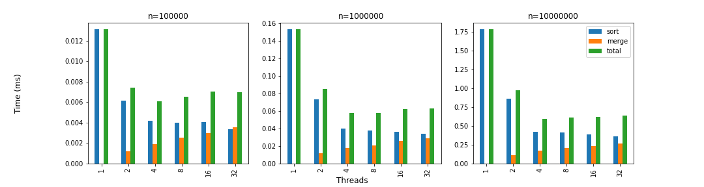

# Parallel Merge Sort

This is a simple implementation of the parallel 'Merge Sort' algorithm using the 'pthreads' API in C.

We expect to be able to show performance comparisons between the regular and parallel versions of the algorithm.

## Running

Simply run

    make

To build, and then

    ./parallel_merge_sort n k

To run. The program will generate a random array of size `n` and sort it using `k` threads. You can also pass `silent` as the third command line parameter to reduce the amount of output.

Alternatively, you can run

    make run

To run the program with the specified parameters defined in the `makefile`.

## Performance

We ran the program multiple times on a quad core machine (no hyperthreading) for different values of `n` and `k` and took the average execution times. These results can be seen in Figure 1:

*Figure 1: the average performance of the program for different values of `n` and `k`. The 'sort' bar refers to the sorting part of the algorithm (the time it took for all threads to sort their respective chunks), the 'merge' bar refers to the merging part of the algorithm (the time it took for all threads to do all the merging operations) and the 'total' bar is the sum of the two.*

The results are aligned with what we expected. There is a considerable gain in performance when switching from 1 to 2 threads, and a smaller gain when upgrading to 4 threads. Increasing the thread count further, however, doesn't improve the overall performance. This is expected, as the program was ran on a 4-core machine, so increasing the amount of threads doesn't result in parallel processing.